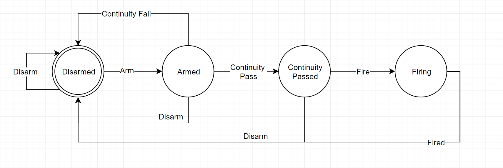
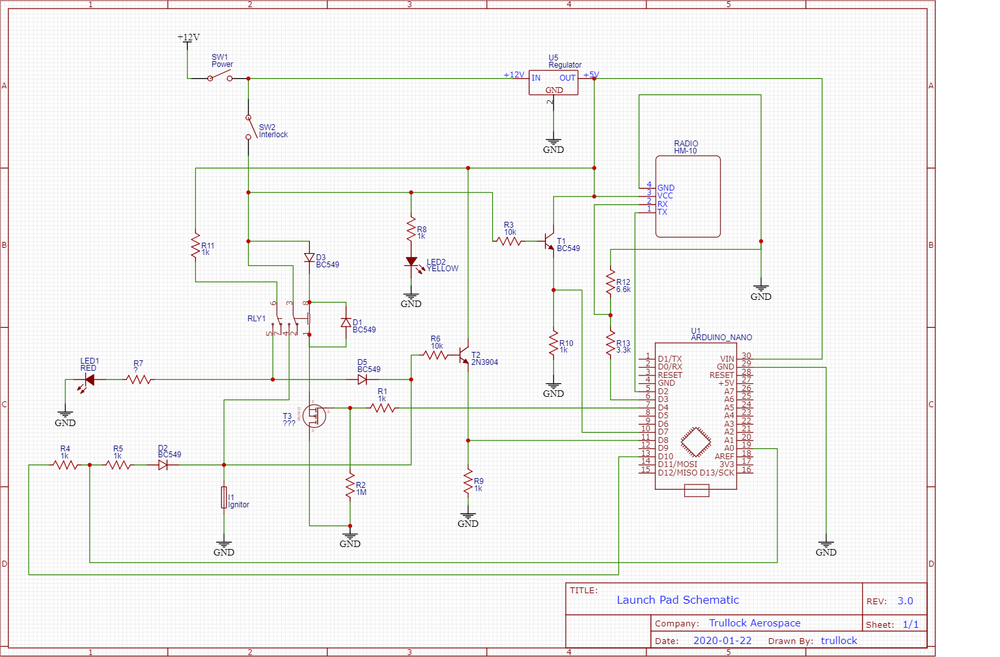

# Wireless Rocket Launch Pad

This project is an Arduino based rocket launch controller, with remote smartphone control app (Remote).

It is designed around saftey and redundancy. Fundamentally all parts of the system must work correctly or fail in a predictable (safe) way. Whereever possible, both hardware and software redundantly detect failures. The system is designed such that any one component failure (i.e. going open circuit or short circuit - deemed IEC 61508 Occasional) must not be able to cause an ignition. There must be a minimum of two IEC 61508 Occasional or less-likely hardware or software failures for unintentional ignition to occur. A risk assessment of each component can be found below.

## Saftey by Design

These are all known mentions of rocketry launch saftey codes with relation to ingition systems. They are cited here so we can discuss how this system is in accordance with them.

### NAR Saftey Code Excerpt:
> Ignition System. I will launch my rockets with an electrical launch system and electrical motor igniters. My launch system will have a safety interlock in series with the launch switch, and will use a launch switch that returns to the “off” position when released.

###  NFPA 1127 Code for High Power Rocketry
> 4.13.1 A high powere rocket shall be launched using an ignition system this is remotely controlled, is electrically operated, and contains a launching switch that returns to the "off" position when released.

> 4.13.2 The ignition system shall contain a removable saftey interlock device in series with the launch switch.

> 4.13.3 The launch system and ignitor combination shall be designed, installed and operated so that liftoff of the rocket occurs within 3 seconds of actuation of the launch system.

### Tripoli Saftey Code Excerpt

Cites NFPA 1127, also including the below stipulations:

> A-5 A rocket motor shall not be ignited by using:
> a. A switch that uses mercury.
> b. "Pressure roller" switches 

N.B. I'm interested to know what event caused these Additional Rulings.

### UKRA Saftey Code

> 2.3.1 Igniter Rules
> ... Any igniter should ignite the rocket within three seconds of the power being applied to the igniter.
> Continuity tests on any motor ignition system should not be carried out whilst the igniter is fitted in the motor, unless the continuity test is an integral part of a count down sequence.
> ... When an igniter test is carried out, a clear and audible warning and countdown should be given of the test, and the tester should not carry out the test until all people who are likely to see or hear the test are fully alerted and prepared for the test.

> 2.5 Launch Controllers
> An electrical ignition system must be used which allows for remote operation of the igniter firing. 
> ... The launch controller must include a safety key to immobilise the system when removed. This key should only be in place at the time of the launch and is to be removed immediately after an ignition attempt, especially in the event of a misfire. The safety key must not be capable of being removed leaving the controller in a live firing mode. The firing circuit must only be live for a brief period sufficient to fire the igniter and must then return to an open circuit. Where a firing button is used, it must return to the off position when released.

> 4.2 Launching
> An electrical ignition system must be used which allows for remote operation of the igniter firing. The device should be operated from at least the minimum safe distance as determined by the total impulse of the rocket motor(s) according to the Safe Distance Table given above. This distance can be shortened with the express permission of the RSO as per section 2.5. Any igniter should ignite the rocket within three seconds of the power being applied to the igniter. UKRA currently only recommend the use of hardwired launch systems. However, progress in stable digital control systems over recent years mean that clubs are can to use radio-controlled systems should they wish to do so. UKRA recommends that such systems are thoroughly checked and tested prior to use.

There are two main concerns/rule-interpretations with this wireless, app-driven launch system which are not necessarily trivially solved or expected-to-be-trivially solved by an RSO.

1. Hackability (deliberate or through electrical interference) of the wireless medium
2. "Removable" series launch-button interlock/key

(1) Can be easily solved via commodity encrypted and/or paired radios.

(2) Is probably more of a contentious point. My interpretation is that the wording of these saftey codes is legacy in its use of "physical" words, but very relevant and pertinent in its implications for saftey. 

I think there are two points here:

1. There should be a cermeony (inserting the key) which makes it obvious and unabiguous that you are entering firing mode. Mentally this is an intentional and deliberate action which you are hopefully doing after obeying all of the various other, previous setup saftey steps.
2. The Firing mechanism should be "removable" or "disableable" so that it is difficult to accidentally trigger a Fire event. 

I argue that the virtual saftey-key measures designed into this system not only meet all of the above saftey criteria, but actaully go much further than most personal and club lauch systems.

## State Management

The Pad is the ultimate controller of state, managing exactly what mode it is in at any one time, and which states it is allowed to transition into. The Remote mirrors this logic, but the system is not reliant on the Remote to properly maintain and permit state transitions. The Pad is in constant communication with the Remote to tell it what state it is in. Should the Remote issue an invalid command the Pad protects against this. Any unexpected command received by the Pad casuse the Pad to disarm itself and revert back to its base Disarmed state.

## Funtional Overview

The system can be in one of 4 states at any one time;

* Disarmed
* Armed
* Continuity-Test-Passed
* Firing

These stages must be entered into sequentially, as respresented by the below state diagram.

Note that this diagram does not detail the logic governing the permissability of any state transition, it simply describes the set of possible states and transitions between them.

## State Transitions and Logic

This section outlines the navigation of the state diagram above.

### Arming

The system can only enter the Armed state if the physical Saftey Interlock is engaged at the Pad. 
The system remains in an Armed state for 20s, after which it reverts to a Disarmed state should it not receive a valid Continuity Test command beforehand.
When in an Armed state:

* a physical indicator light at the pad is illuminated (Armed)
* a warning siren sounds at the pad
* a virtual indicator is shown on the Remote
* the Remote is allowed to issue a Disarm and/or Continuity Test command

### Performing a Continuity Test

A continuity test of the electrical ignition system (Ignitor) can only be performed when the system is in an Armed state.
A continuity test can only be performed from the Remote. For saftey there is no physical continuity test mechanism at the Pad.
If the continuity test fails, the system immedately reverts to a Disarmed state.
If the continuity test passes, the system transitions to the Continuity-Test-Passed state.

### Continuity-Test-Passed

The system remains in an Continuity-Test-Passed state for 20s, after which it reverts to a Disarmed state should it not receive a valid Fire command beforehand.

When in a Continuity-Test-Passed state:

* a physical indicator light at the pad is illuminated (Ready)
* a warning siren sounds at the pad
* a virtual indicator is shown on the Remote
* the Remote is allowed to issue a Disarm and/or Fire command

### Firing

The system can only enter the Firing state from the Continuity-Test-Passed state.
The system remains in the Firing state for at most 3s. Whilst in the Firing state, a continuity-test is performed to detect Ignitor ignition. Which ever occurs first, Ignitor continuity-failure or 3s elapsed, triggers the system to disarm itself into the Disarmed state.
Whilst in the Firing state:

* a phsyical indicator light at the Pad is illuminated (Firing)
* a warning siren sounds at the Pad
* a virtual indicator is shown on the Remote
* the Remote is allowed to issue a Disarm command

## State and Error Detection

Wherever possible, there are both hardware and software error detection and warning systems. Should the system be in an unexpected or unintentional hardware state, hardware indicators alert this and software indicators disarm the system.

### Physical Saftey Interlock

A physical Saftey Interlock (key switch) at the Pad must be engaged before the system can leave the Disarmed state.
Disengaging the Saftey Interlock causes the system to instantly disarm itself into the Disarmed state.

When the Saftey Interlock is engaged:

* a physical indicator light at the pad is illuminated (Engaged)
* a virtual indicator is shown on the Remote
* the Remote is allowed to issue an Arm command

The two indications of Saftey Interlock Engagement (indicator light at the Pad and Remote indicator) are driven by separate electronics. The Engaged indicator at the Pad is driven directly from electrical components and does not rely on software. The Remote indicator is detected by software.

Prior to engaging the Saftey Interlock, it is conceivable but IEC 61508 Remote that the firing relay is erroneously in a closed state. This is warned pre-engagement by an electronically controlled indicator light at the Pad, a software controlled warning siren at the Pad and a software controlled indicator on the Remote. See `Firing and Continuity Testing` below for further information.

### Armed and Continuity-Test-Passed States

These are software-only states and have no electronic or physical side effects except indications of them being the current state. As such there is no parallel electronic detection circuitry for these states.

### Firing and Continuity Testing

The Firing mechanism has multiple levels of failure saftey and redundancy to prevent accidental premature ignition.
The relay is a DPDT. One of it's circuits is the 12V ignition system and the other is a 5V state-detection system. When the relay is closed unintentionally (either through software failure or hardware failure) the logic circuit should be closed, providing and indication to the software that the relay is in an unexpected state.

When the relay is closed for any reason:
* a Firing indictor light is illuminated at the Pad
* a virtual Firing indicator is shown on the Remote
* a warning siren sounds at the Pad

When the relay is closed unexpectedly:
* software detects this and disarms the system.

As an additional level of redundancy, the software detection of the relay being closed is driven by the 12V system as well as the 5V system

# Electronics

## Component Discussion and Failure Risk Analysis

### LED1, R7

This is the Firing indicator, showing that ignition-current is present at the ignitor.

If these components fail, T2 et al provide redundant detection.

### T2, D5, R6, R9

These components enable software detection of Firing.

If these components fail closed-circuit:
* when software doesn't expect firing to be occurring: software will disarm the system.
* when software does expect firing to be occurring: firing should be happening anyway, and normal Firing->Disarmed state transitioning will occur safely.

If these components fail open-circuit, LED1 et al provide redundant detection.
* when Firing occurs, software will detect that Firing does not appear to be happening (because of the fault) and will immediately cease attempting to fire, disarming itself.

## LED2, R8

This is the Interlock indicator, showing that the Interlock is engaged.
If these components fail, T1 et al provide redundant detection.

### T1, R3, R10

These components enable software detection of Interlock engagement.
If these components fail open-circuit, software will never allow firing.
If these components fail closed-circuit, LED2 et al provide redundant detection.

### T3, R1, R2

These components initiate the Relay R1 to fire the ignitor.
If these components fail causing the transistor to engage the firing relay, the Interlock must be engaged and the two Firing indicators ignored for unexpected ignition.

### R4, R5, D2

These components facilitate software continuity detection. Hardware continuity detection does not exist as Pad based continuity detection is deliberately not supported.

If these components fail open-circuit, software will never consider there to be continuity and so will never enable firing.

If these components fail closed-circuit, the Ardino cannot supply enough current to fire the ignitor.

### RLY1

This is the firing relay.
If if fails so that it can never close, there is no risk of firing.
If it fails so that is is unexpectedly closed, both the hardware and software Firing Indicators would be engaged to alert about the fault.

### Regulator, Arduino, Radio

If these components suffer a hardware failure, it is assumed that the worst-case occurs and 5V or 12V appear on the analog and digital pins.

No single path exists for 12V being present on the Arduino's in/output pins to supply enough current to the ignitor without other additional component failures.

# Credit

Icons used in the Launch Remote by https://www.flaticon.com/authors/kirill-kazachek